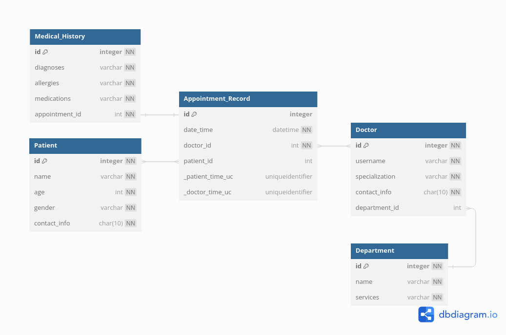

# LOCH - Hospital Management System

Find postman collection and environment json files for the application at the root of the repository

## Setting Up and Running the application

### A. Using Docker:

1. Build the Docker image from the docker file (Dockerfile) at the root of the repository
```
docker build -t loch-hospital-management-system .
```

2. Run the Docker container
```
docker run -d -p 5000:5000 loch-hospital-management-system
```

### B. Using Local Machine

1. Create a virtual environment and activate it.
```
python3.10 -m venv '.venv'
source venv/bin/activate
```

2. Install dependencies 
``` 
pip install -r requirements.txt 
```

3. Run flask application locally 
``` 
flask run
```

4. Swagger Documentation for the application and API's link
Note:- Flask's dev server defaults to port 5000 if no port is specified
```
localhost:5000/swagger-ui
```
5. Flask enivronment file at the root of the directory
```
FLASK_APP = app
#FLASK_ENV = development
FLASK_DEBUG = 1
#DATABASE_URL = "<Connection string to your intended database>" #If not present, defaults to a sqlite file
```
Note:- Uncomment and enter connection string of intended database infornt of DATABASE_URL
       If DATABASE_URL is not specified, storage defaults to a local SQLite file in the instance directory
       Attaching data popualted while testing in the instance directory (data.db) SQLite file for reference.
       Delete "instance" folder before running application for a freshly created SQLite database.

Download Link for SQLite DB Browser - Extension for viewing SQLite datas
```
https://sqlitebrowser.org/dl/
```

## Database Diagram
<p align="center">
 </a>
</p>


### Underlying Assumptions in the system design
1. Doctor can or cannot belong to a department.
2. Appointment Record must have a doctor and time associated to it.
3. Appointment Records with no patient assigned are available slots.
4. Medical History is only recorded on a Appointment.
